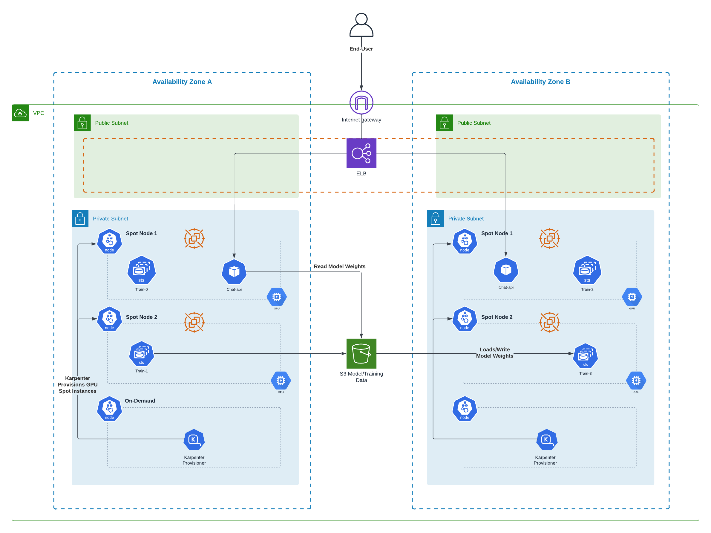

# Summary

Stu-GPT is a platform which enables massive parralel processing and training of Large Langauge Models (LLMs) on AWS.

## Model Architecture

The primary model used is a Generative Pre-trained Transformers (GPT) which is a deep learning model which makes use of the transformer architecture.

Transformers
rely on a mechanism of self-attention enables positional encoding and prediction  of the next best token based on the full input sequence of the model.

## Training

The training of the model leverages Pytorch's DDP module for distributed training. implements data parallelism at the module level which runs on GPU optimized hardware.

## Deployment Architecture

* **EKS**: Used to orchestrate and host model training, serving and monitoring.
* **Karptener**: Provides Groupless cluster autoscaling to simplify scaling of distributed training jobs on K8s. In addition, Karpenter is used to provision a spot instance fleet to enable usage of GPU Spot instances.
* **Trainer**: The trainer is built on Stateful Set to enable fault tolerent parrellel training. With Karpenter and Pytorch's DDP the platform can abitrarily scale based on the required compute workload.
* **Chat-Api**: Performs the model inferences which insert the text prompts and fetches the returned response to the client.

#
