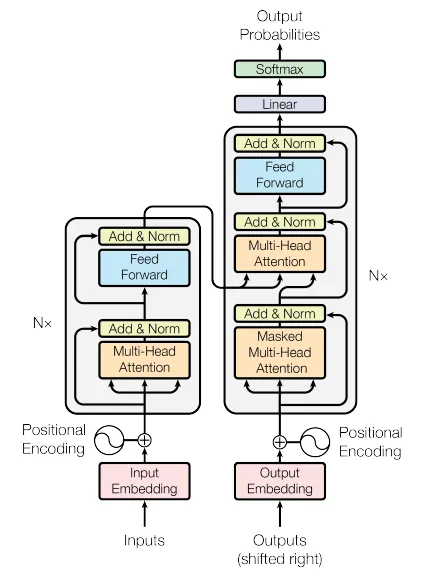

# Summary 

Generative Pre-trained Transformers (GPT) are a type of deep learning model that uses unsupervised learning to train a large neural network on a vast amount of text data. The main idea behind GPT is to pre-train a large neural network on a large corpus of text data, such as web pages or books, to learn general patterns and structures of language.

During the pre-training phase, the neural network learns to predict the next word in a sequence of words. This is done by feeding the network a sequence of words and asking it to predict the next word in the sequence. The network is trained to minimize the difference between its predictions and the actual next words in the text.

Once the pre-training is complete, the GPT model can be fine-tuned for a specific task, such as text generation, text classification, or question-answering. Fine-tuning involves training the model on a smaller dataset of labeled examples that are specific to the target task. During fine-tuning, the weights of the pre-trained model are adjusted to fit the task-specific data.

The resulting fine-tuned model can then be used to generate new text by sampling from the learned distribution of words and sequences. GPT models have achieved impressive results in various natural language processing tasks, such as language translation, text summarization, and dialogue generation.

## Transformer Architecture

GPT is based primarily on transformer architecture which was introduced in 2017 in Google's paper "Attention is all you need". 

The encoder takes as input a sequence of embeddings (representations of words or subwords) and generates a sequence of encoded embeddings, which capture the relationships between the words in the input sequence. Each layer in the encoder performs two operations: multi-head self-attention and a feedforward neural network.

In the multi-head self-attention operation, the model calculates a weighted sum of the input embeddings based on their relevance to each other. This allows the model to capture long-range dependencies between words in the input sequence.

In the feedforward neural network operation, the model applies a non-linear transformation to the output of the self-attention operation.

In addition to the encoder, the Transformer architecture also includes positional encodings, which allow the model to understand the order of the input sequence.

Overall, the Transformer architecture is highly effective in natural language processing tasks and has achieved state-of-the-art performance on many benchmarks.

